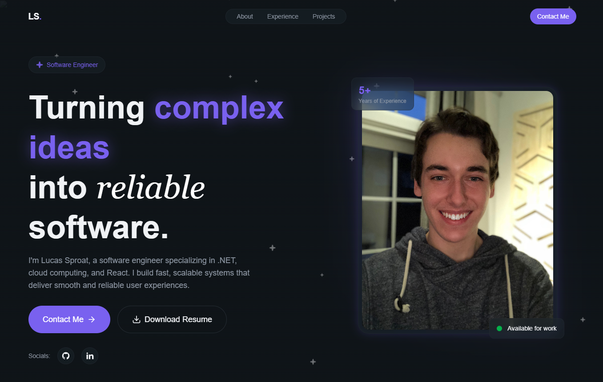
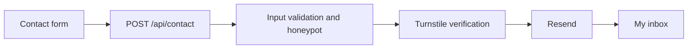

# Lucas Sproat | Portfolio

My personal portfolio, built to share my work and experience. My background is in C#/.NET and Azure; this project gives me room to explore frontend development, serverless APIs, and visual design.

**[Visit lucassproat.com](https://lucassproat.com)** · [LinkedIn](https://www.linkedin.com/in/lucassproat/) · [GitHub](https://github.com/lsproat)



## Why I built it

I started this site while looking for my next software engineering role. A résumé can describe my experience, but I wanted to give people something they could explore and see working. It also gives me a reason to keep learning outside of work.

That curiosity has led me to small games, 3D modeling and rendering, and local AI models connected to my Home Assistant setup. This portfolio is another outlet for that interest in creating things.

## What you'll find

- A responsive layout with project showcases, a career timeline, teammate testimonials, and access to my résumé.
- A layered star background that responds to scrolling, plus a timeline that highlights the experience nearest the center of the screen.
- A contact form with server-side validation, spam checks, and email delivery to my regular inbox.

## Built with

| Area | Tools |
| --- | --- |
| Interface | React 19, JavaScript, Tailwind CSS 4 |
| Build tooling | Vite 8, npm, ESLint |
| Hosting and API | Vercel, Vercel Node functions |
| Contact delivery and verification | Resend, Cloudflare Turnstile |
| Other tools | GitHub Actions, Node's built-in test runner, Vercel Analytics, Lucide and Remix icons |

## Implementation notes

**Animation outside React's render cycle.** The stars reuse a fixed pool of elements, adapt to viewport size, and move through `requestAnimationFrame`. They pause when the page is hidden or the visitor prefers reduced motion. The timeline also updates positions directly, changing React state only when the highlighted card changes.

**Email stays on the server.** The contact flow is:



The API validates input and caps JSON requests at 32 KB. A filled honeypot returns success without sending email. Other submissions require a valid, single-use Turnstile token with the `contact_form` action. The Managed widget appears only when interaction is needed.

Emails use plain text, an authenticated sender, and the visitor's address as Reply-To. Secrets and inbox configuration stay server-side. Errors are generic; contact contents are not logged. Failed submissions retain the message and request fresh verification.

There is no database or application rate limiter, and spam protection is not absolute. A connection failure after email acceptance can leave delivery uncertain; the form reports when it cannot confirm delivery.

### Code map

| Location | Purpose |
| --- | --- |
| `src/sections/` | Page content and contact form |
| `src/components/` | Shared UI, star field, and Turnstile widget |
| `src/hooks/useTimelineProgress.js` | Scroll-driven timeline behavior |
| `src/index.css` | Theme and shared styles |
| `api/contact.js` / `server/contact.js` | Vercel endpoint and contact handler |
| `public/` / `tests/` | Static assets and automated checks |

## Run locally

Use Node.js 22.12 or newer and npm.

```sh
git clone https://github.com/lsproat/PortfolioWebsite.git
cd PortfolioWebsite
npm ci
npm run dev
```

This runs the frontend. The contact widget needs a public site key, and **Vite alone does not run the API**.

### Contact configuration

Use [.env.example](.env.example) to configure your ignored `.env.local`, preserving existing values.

| Variable | Purpose |
| --- | --- |
| `RESEND_API_KEY` | Server-only Resend key |
| `CLOUDFLARE_TURNSTILE_SECRET_KEY` | Server-only Turnstile secret |
| `CLOUDFLARE_TURNSTILE_SITE_KEY` | Public site key, explicitly exposed by Vite at build time |
| `RESEND_FROM_EMAIL` | Bare sender address on your verified Resend domain |
| `CONTACT_TO_EMAIL` | Existing inbox that receives submissions |

Create a **Managed** Turnstile widget with your hostnames allowed, including `localhost` for local testing with real keys. Enable sending in Resend and verify your domain; receiving is unnecessary. Never prefix secrets with `VITE_` or commit secret files.

For the complete flow, link your Vercel project and configure these variables in its **Development** environment:

```sh
npx vercel dev
```

Open the printed URL and restart after environment changes. In PowerShell, use `npm.cmd` or `npx.cmd` if script execution restrictions block the commands.

## Checks

```sh
node --test
npm run lint
npm run build
```

Tests cover star placement, resizing, and motion, plus contact validation, spam checks, body limits, and provider failures. Contact tests mock both providers; they need no real keys and send no email.

**Known issue:** one star-field test expects 300 pooled stars; the configuration totals 150. The suite currently has 34 passes and one failure.

Manual checks include keyboard navigation, narrow layouts, reduced motion, verification expiry/retry, inbox delivery, Reply-To, and repeated submissions. `npm run preview` serves the built frontend only.

## Deployment

Pushing to `main` triggers a [GitHub Actions deployment to Preview](.github/workflows/vercel-preview.yml). Vercel also builds for production, but publication waits for my manual approval after testing. That release gate is configured in Vercel, outside the workflow.

The workflow needs `VERCEL_ORG_ID`, `VERCEL_PROJECT_ID`, and `VERCEL_TOKEN` as GitHub Actions secrets. Set contact variables for Vercel's Development, Preview, and Production environments, and allow their hostnames in Turnstile. Redeploy after environment changes; the public site key is embedded at build time.

## Where it goes next

Many visitors will already have seen my résumé or LinkedIn profile. I want the site to give them another reason to stay: an interesting visual journey that encourages them to explore further. I plan to keep experimenting with visuals and animation while keeping the content readable and navigation useful.

## Starting point and AI use

The site began with [this portfolio tutorial](https://www.youtube.com/watch?v=cIYdiRDFWQw). I have since changed the content, visuals, and implementation, extending functionality and adding security measures. I want to keep making it my own while acknowledging where it started.

Most of the application code was written without coding agents. My main use of AI was as a reference: asking questions, working through unfamiliar concepts, and understanding the options in front of me. Agents did help implement some portions and create tests. I reviewed that code, worked through how it behaved, and questioned the implementation and security decisions. I do not want to present code I cannot explain.

AI also helped substantially with this README. The motivations and experiences described here are mine.

## Reusing the code

You are welcome to reuse and adapt my original code. Replace my personal content, résumé, photos, and testimonials with your own. Third-party code and assets retain their respective terms; the tutorial is credited above, and the icon libraries are listed in the stack.

## References

[Vercel functions](https://vercel.com/docs/functions/runtimes/node-js) · [Vercel environment variables](https://vercel.com/docs/environment-variables) · [Turnstile validation](https://developers.cloudflare.com/turnstile/get-started/server-side-validation/) · [Turnstile configuration](https://developers.cloudflare.com/turnstile/get-started/client-side-rendering/widget-configurations/) · [Resend sending](https://resend.com/docs/api-reference/emails/send-email)
